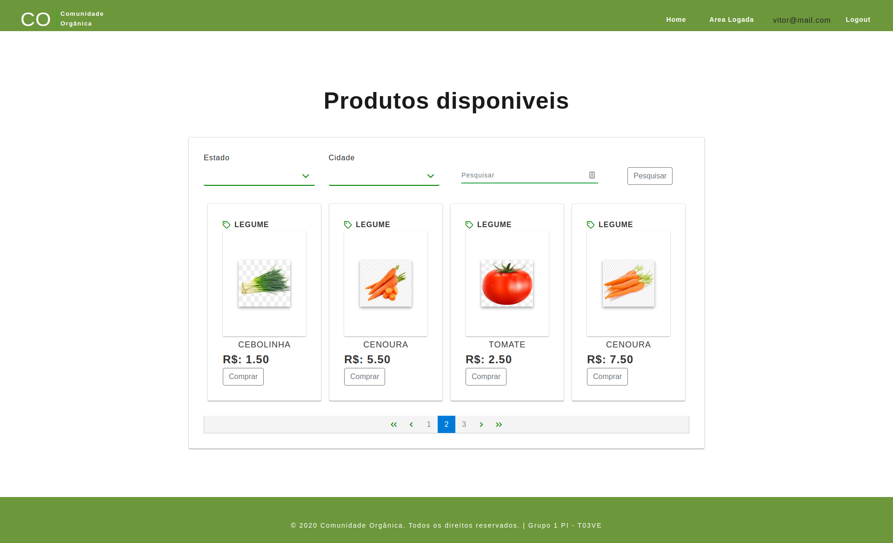

<h1 align="center">Projeto Comunidade Orgânica</h1>

 

<h2 align="center">Print</h2>

  

## 🚀 Tecnologias

Esse projeto foi desenvolvido com as seguintes tecnologias:

- [Angular]
- [Bootstrap]
- [PrimeNG]
- [Java]
- [Spring]
- [AWS]
- [MySql]

## 💻 Projeto

[Clique aqui](https://comunidadeorganica.herokuapp.com/ "Site em Deploy") para conferir o site em seu browser 🖖

Esse foi o Projeto Integrador que desenvolvi com o Michael para o curso de desenvolvimento fullstack com Java da Digital House em parceria com o Santander.
